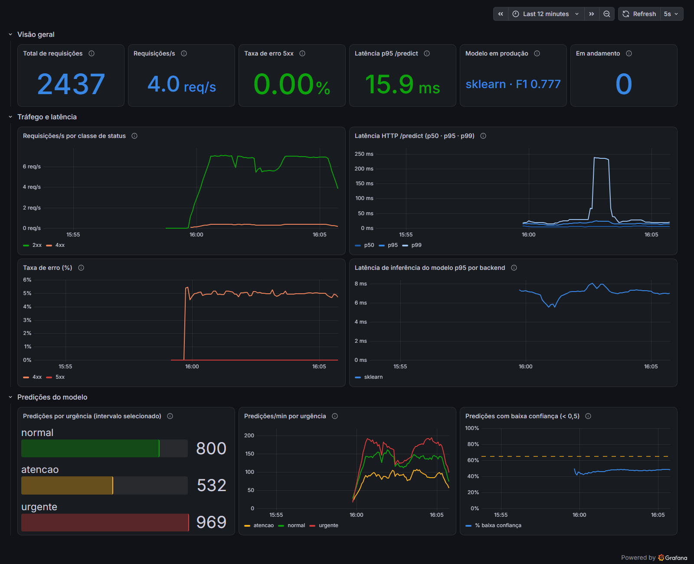

# TC3: Triagem de Laudos Médicos com FastAPI, Docker, Airflow, Prometheus/Grafana e ONNX

[](https://github.com/Plee47/TC3-Triagem-de-Laudos-Medicos-com-FastAPI-Docker-Airflow-Prometheus-Grafana-e-ONNX/actions/workflows/ci.yml)

Pipeline de MLOps para triagem automática de laudos médicos: um classificador de texto leve (TF-IDF + Regressão Logística) define a condição do laudo e a traduz em urgência (**normal / atenção / urgente**). O modelo é servido por uma API FastAPI em Docker, com CI/CD no GitHub Actions, retreino orquestrado pelo Airflow, observabilidade com Prometheus + Grafana e otimização de latência via ONNX Runtime.

> Status: **as 4 etapas estão concluídas**: API em Docker, CI/CD (cada push na `main` publica no GHCR a imagem que passou no smoke test), DAG de retreino, monitoramento e otimização com ONNX Runtime. Com o ONNX, o modelo isolado ficou **~2x mais rápido** que com o sklearn (2,6x na média dentro do container), e as predições são idênticas.

## Sumário
- [Dataset e premissas](#dataset-e-premissas)
- [Decisão arquitetural (nuvem)](#decisão-arquitetural-nuvem)
- [Deploy na AWS](#deploy-na-aws)
- [Modelo e resultados](#modelo-e-resultados)
- [Latência: baseline e otimização com ONNX](#latência-baseline-e-otimização-com-onnx)
- [CI/CD (GitHub Actions)](#cicd-github-actions)
- [Retreino (Airflow)](#retreino-airflow)
- [Monitoramento (Prometheus + Grafana)](#monitoramento-prometheus--grafana)
- [Como executar](#como-executar)
- [API](#api)
- [Estrutura do repositório](#estrutura-do-repositório)
- [Time](#time)
- [Licença](#licença)

## Dataset e premissas

**Medical Abstracts TC Corpus** ([Kaggle](https://www.kaggle.com/datasets/saharalaa/medical-abstracts-tc-corpus) · [repositório dos autores](https://github.com/sebischair/Medical-Abstracts-TC-Corpus)): 14.438 abstracts médicos em inglês, 11.550 de treino e 2.888 de teste, em 5 classes. Os CSVs estão **versionados no repositório** em [`data/raw/`](data/raw/), com a atribuição e a licença (CC BY-SA 3.0) em [`data/raw/README.md`](data/raw/README.md). Assim, a ingestão (`medical_triage.data.ingest`) só lê e valida os arquivos locais, e treino, CI e DAG rodam sem acesso à rede e sempre sobre os mesmos dados. Para atualizar a partir da fonte, use `python -m medical_triage.data.ingest --download`.

**Da condição para a urgência.** O corpus não tem rótulo de urgência. O modelo aprende as 5 condições (sinal real do dataset) e a urgência é derivada por uma tabela versionada em [`configs/urgency_map.yaml`](configs/urgency_map.yaml):

| Rótulo | Condição | Urgência |
|---|---|---|
| 3 | Nervous system diseases | **urgente** |
| 4 | Cardiovascular diseases | **urgente** |
| 1 | Neoplasms | atenção |
| 2 | Digestive system diseases | normal |
| 5 | General pathological conditions | normal |

> ⚠️ Esse mapeamento é uma **premissa de negócio do projeto**, não um critério clínico validado. Em produção ele seria definido com a equipe médica; por estar em configuração, pode mudar sem retreinar o modelo.

**Qualidade dos dados (o que encontramos e como tratamos):**

| Achado | Impacto | Tratamento |
|---|---|---|
| 1.956 abstracts do treino aparecem repetidos com **rótulos diferentes** (textos multi-condição) | rótulo ambíguo; deduplicar sem critério escolhe um rótulo arbitrário | cada texto fica com a condição **mais urgente** (conservador para triagem); empate → menor rótulo, que prefere uma condição específica à "general" |
| 113 abstracts do teste também aparecem com mais de um rótulo | o mesmo texto contaria mais de uma vez na avaliação, com rótulos que se contradizem | mesma regra do treino: as 2.888 linhas do teste viram 2.770 textos únicos |
| 988 abstracts do teste oficial **também estão no treino** | vazamento: a métrica de teste fica distorcida | esses textos são removidos do teste |

Depois do tratamento: treino 8.028 · validação 1.417 (split estratificado) · teste 1.782 (2.770 textos únicos menos os 988 vazados). O `preprocess` registra essas contagens no log e as devolve no resultado da task, que fica no XCom da DAG.

## Decisão arquitetural (nuvem)

**Cenário:** triagem de laudos na chegada ao hospital. O valor está em priorizar um caso urgente *no momento* em que o laudo é emitido, então a inferência é **real-time (online)**, e não batch. O batch continua útil para *retreinar* o modelo e reprocessar o histórico, e esse papel fica com o Airflow.

**Proposta na AWS:**

```
Sistema do hospital (HIS/RIS) ──HTTPS──▶ API Gateway / ALB ──▶ ECS Fargate (container FastAPI + ONNX Runtime)
                                                                   │   ▲
                                                 métricas /metrics │   │ carrega model.onnx
                                                                   ▼   │
                                         Amazon Managed Prometheus ─▶ Amazon Managed Grafana
                                                                       │
          MWAA (Airflow): ingestão → pré-processamento → treino → avaliação → export ONNX ──▶ S3 (registro de modelos)
                                                                                              │
                                              GitHub Actions: lint → test → build → push ECR ─┘
```

| Decisão | Escolha | Por quê |
|---|---|---|
| Padrão de inferência | Real-time, síncrono | Triagem exige resposta imediata; o modelo responde em milissegundos |
| Computação | **ECS Fargate** (container) | O mesmo Dockerfile do projeto roda sem mudança; autoescala por CPU e requisições; sem servidores para gerenciar. Lambda foi descartado por causa do cold start ao carregar o modelo; SageMaker Endpoint funciona, mas custa mais e acrescenta pouco para um modelo linear leve |
| Artefatos | S3 (modelos versionados) + ECR (imagens) | Separa o ciclo do modelo do ciclo do código |
| Retreino | MWAA (Airflow gerenciado) | A mesma DAG usada localmente, com `data/processed` e `models/` apontando para prefixos no S3, porque os workers do MWAA não compartilham disco local |
| Observabilidade | Managed Prometheus + Managed Grafana | São as mesmas métricas e dashboards da stack local |
| Segurança / LGPD | VPC privada, TLS, sem persistir o texto do laudo, logs sem PHI | Laudo é dado sensível de saúde |

**Equivalentes em outras nuvens:** GCP Cloud Run + Cloud Composer + Managed Prometheus; Azure Container Apps + Airflow no AKS/Data Factory + Azure Monitor.

## Deploy na AWS

A API está publicada na AWS (região `us-east-2`). A imagem Docker do projeto fica no **ECR** e roda no **ECS Express**, que provisiona o serviço Fargate com um **ALB** na frente:

```
                    AWS
                     │
                    ECR
                     │
                     ▼
                ECS Express
                     │
                     ▼
                    ALB
                     │
                     ▼
           FastAPI + ONNX Runtime
                     │
             ┌───────┴───────┐
             ▼               ▼
          /health         /predict
```

| Recurso | URL |
|---|---|
| API (Swagger) | https://me-b245f687784748fa8d5e31aef7e34538.ecs.us-east-2.on.aws/docs |
| Métricas (Prometheus) | https://me-b245f687784748fa8d5e31aef7e34538.ecs.us-east-2.on.aws/metrics |
| Health check | https://me-b245f687784748fa8d5e31aef7e34538.ecs.us-east-2.on.aws/health |

```bash
curl -X POST https://me-b245f687784748fa8d5e31aef7e34538.ecs.us-east-2.on.aws/predict \
  -H "Content-Type: application/json" \
  -d '{"text": "Acute myocardial infarction in patients with coronary artery disease..."}'
```

## Modelo e resultados

`TfidfVectorizer` (unigramas + bigramas, 50k termos) → `LogisticRegression` (`class_weight="balanced"`). Os hiperparâmetros estão em [`params.yaml`](params.yaml). O treino leva cerca de 15 s em CPU. O vocabulário é montado de forma que o modelo converta para ONNX sem perda (veja a [seção de latência](#latência-baseline-e-otimização-com-onnx)).

| Conjunto | Acurácia | Macro-F1 (5 classes) | Macro-F1 urgência (3 níveis) | Recall de "urgente" |
|---|---|---|---|---|
| Validação | 0,765 | 0,761 | 0,815 | 0,841 |
| Teste (sem vazamento) | 0,786 | 0,782 | 0,824 | **0,858** |

A classe mais difícil é *general pathological conditions* (F1 de 0,67): ela é genérica por definição e se sobrepõe às demais. As métricas completas, por classe, ficam em `models/metrics.json`, gerado no treino, com uma cópia versionada em [`reports/metrics.json`](reports/metrics.json).

### Limitações

- O modelo foi treinado com abstracts médicos em inglês, e não com laudos reais. O cenário de triagem hospitalar é a motivação do projeto, não um uso validado.
- Texto sem nenhuma palavra legível (só espaços, emoji, pontuação ou alfabeto não latino) ou sem nenhum termo do vocabulário do modelo recebe **422** no `/predict`, em vez de uma triagem. Um laudo em português cai aqui quando nenhuma das palavras dele está no vocabulário.
- Texto em português ou fora do domínio que compartilha alguns termos com o vocabulário passa por essa checagem e ainda pode cair em "normal" com confiança baixa. É esse tipo de entrada que o alerta de baixa confiança acompanha, no agregado (veja [Monitoramento](#monitoramento-prometheus--grafana)).
- Um uso real exigiria laudos rotulados em português e o mapeamento de urgência definido com a equipe médica.

## Latência: baseline e otimização com ONNX

**Otimização aplicada:** o pipeline é exportado para **ONNX** (`skl2onnx`) e servido com **ONNX Runtime**, que é o backend padrão da imagem (`MODEL_BACKEND=onnx`). O relatório completo, com metodologia, dados brutos e prints, está em [`reports/latency.md`](reports/latency.md).

| Medição | sklearn | ONNX | Ganho |
|---|---|---|---|
| Só o modelo, in-process, p50 (`scripts/benchmark_latency.py`) | 1,19 ms | 0,57 ms | **2,1x** |
| Só o modelo, no container, média (Prometheus, A/B) | 3,17 ms | 1,23 ms | **2,6x** |
| Só o modelo, no container, p95 (aproximado, interpolado dos buckets) | 7,02 ms | 2,49 ms | **2,8x** |
| HTTP `/predict` no servidor, p95 / p99 | 16,4 / 26,6 ms | 10,0 / 14,7 ms | **−39% / −45%** |
| Tamanho do artefato | 3,5 MB | 2,6 MB | −26% |

Os percentis no container saíram de um histograma de inferência com bordas em 1 ms e 2,5 ms. O p95 do ONNX (2,49 ms) cai em cima da borda e diz só que ele ficou abaixo de 2,5 ms; a média vem da soma e da contagem do histograma e é exata. A API agora usa buckets próprios para a inferência, de 0,25 ms a 100 ms, para que as próximas rodadas meçam o ONNX com mais precisão.

**Paridade:** nos 1.782 laudos de teste, 100% dos rótulos são iguais e a diferença máxima de probabilidade é 2,6e-7 (a concordância deixa de fora 1 texto com empate exato entre classes, `ties_excluded`). Esses números e as métricas da tabela de resultados estão em [`reports/metrics.json`](reports/metrics.json). Para chegar nisso foi preciso corrigir quatro divergências do conversor: regex do tokenizer, `sublinear_tf`, bigramas órfãos e locale. O detalhamento está no [relatório](reports/latency.md#paridade-o-que-precisou-ser-corrigido). O `export_onnx` falha se a paridade quebrar, o que impede a promoção na DAG.

Em **lote** (64 laudos por chamada) o sklearn tem mais vazão, mas a triagem é real-time, com um laudo por requisição, e nesse caso o ONNX ganha.


**Baseline da Etapa 1** (API em container, backend sklearn, 1 worker uvicorn, modelo da Etapa 1), medido no cliente com `scripts/load_test.py`:

| Cenário | Throughput | p50 | p95 | p99 | Erros |
|---|---|---|---|---|---|
| 500 req, concorrência 1 | 68 req/s | 11,2 ms | 30,4 ms | 34,0 ms | 0 |
| 1000 req, concorrência 4 | 110 req/s | 32,0 ms | 65,6 ms | 102,7 ms | 0 |

Medido no cliente, o número inclui cerca de 10 ms de encaminhamento de porta do Docker Desktop no Windows. Por isso a comparação acima usa as métricas do próprio servidor.

## CI/CD (GitHub Actions)

[`.github/workflows/ci.yml`](.github/workflows/ci.yml) roda a cada push na `main` e a cada pull request:

```
lint ──┬──▶ test ─────────┬──▶ build ──▶ push GHCR (só na main)
       ├──▶ dag-validate ─┤
       └──▶ monitoring ───┘
```

| Job | O que faz |
|---|---|
| `lint` | `ruff check` e `ruff format --check` |
| `test` | `pytest` com cobertura (dados, triagem, treino, registry, API) |
| `dag-validate` | instala o Airflow 3.3.2 com as constraints oficiais, carrega a `DagBag` e confere as dependências entre as tasks |
| `monitoring` | roda o `promtool check config` na mesma imagem do Prometheus do `docker-compose.yml`, o que valida também as regras de `alerts.yml`, e falha se o JSON do dashboard for diferente do gerado por `scripts/build_grafana_dashboard.py` |
| `build` | treina com o dataset versionado, exporta para ONNX com checagem de paridade, aplica o quality gate, faz o `docker build` e sobe o container com **cada** backend (sklearn e ONNX) para um smoke test de `/health` e `/predict`. Num push na `main`, publica essa mesma imagem em `ghcr.io/plee47/medical-triage` com as tags `<sha>` e `latest`. Em pull request só valida |

## Retreino (Airflow)

A DAG [`dags/medical_triage_retrain.py`](dags/medical_triage_retrain.py) roda toda semana (`@weekly`) ou quando é disparada manualmente. Ela já nasce despausada (`is_paused_upon_creation=False`), então a execução agendada mais recente (a do último domingo; com `catchup=False`, só ela) começa sozinha logo depois do `up`. Como os CSVs de `data/raw/` são versionados, o agendamento semanal é demonstrativo: sem dados novos, o retreino reproduz o mesmo modelo, e um modelo novo só aparece quando os dados mudam.

```
ingest ──▶ preprocess ──▶ train_candidate ──▶ export_onnx ──▶ quality_gate ──▶ promote
```

- **ingest**: lê e valida os CSVs versionados em `data/raw/`. O parâmetro `download=true`, ao disparar a DAG, rebaixa os arquivos da fonte.
- **preprocess**: limpa o texto, resolve rótulos multi-condição, faz o split e remove o vazamento do teste.
- **train_candidate**: treina em `models/candidate/`, sem mexer no modelo em produção.
- **export_onnx**: gera o `model.onnx` do candidato e falha se ele divergir do sklearn.
- **quality_gate**: decide na **validação**. Aprova o candidato só se ele atingir macro-F1 ≥ 0,70 e recall de "urgente" ≥ 0,75 e não piorar nem o macro-F1 nem o recall de "urgente" do modelo em produção em mais de 0,02 (`max_regression`). O teste fica só para o número final reportado. Os limites ficam em [`params.yaml`](params.yaml). Se o candidato for reprovado, a task faz *short-circuit* e o `promote` fica como **skipped**.
- **promote**: antes de trocar qualquer arquivo, arquiva o conjunto atual inteiro (`model.joblib`, `model.onnx` e `metrics.json`) em `models/archive/<timestamp>/`. Depois troca um arquivo por vez, cada um por cópia temporária + rename, com o `metrics.json` por último: se a promoção parar no meio, ele ainda descreve o modelo antigo. Cada arquivo é trocado de forma atômica, o conjunto não.

As tasks só orquestram. Toda a lógica está em `medical_triage.*` e é testada sem precisar do Airflow.

A DAG foi validada ponta a ponta no Airflow 3.3.2 em Docker (Linux) quando o gate ainda media no teste: as 6 tasks terminaram com sucesso, o modelo foi aprovado (macro-F1 0,782) e o `model.onnx` foi promovido junto com o `model.joblib`. Com o limite elevado de propósito para 0,99, o gate reprovou o candidato e o `promote` ficou como skipped. Essa rodada no Docker não foi repetida depois que o gate passou a medir na validação: a nova regra é coberta pelos testes do `registry`, e os números de validação em [`reports/metrics.json`](reports/metrics.json) (macro-F1 0,761 e recall de "urgente" 0,841) passam nos limites.

```bash
# só no Linux, antes do primeiro up: o container usa o seu UID para escrever em data/ e models/
echo "AIRFLOW_UID=$(id -u)" >> .env
docker compose -f docker-compose.airflow.yml up -d --build
# UI em http://localhost:8081 (login desabilitado, apenas para uso local)
# a primeira execução começa sozinha; o trigger roda o retreino de novo (entra na fila atrás dela)
# espere a DAG aparecer em `airflow dags list` antes do trigger
docker compose -f docker-compose.airflow.yml exec airflow airflow dags trigger medical_triage_retrain
```

## Monitoramento (Prometheus + Grafana)

```bash
docker compose up -d --build        # API + Prometheus + Grafana (treine o modelo antes, senão o build falha)
poetry run python scripts/load_test.py -n 2400 -c 2 --rate 8 --invalid-ratio 0.05   # gera tráfego
```

| Serviço | URL |
|---|---|
| API (Swagger) | http://localhost:8080/docs |
| Métricas brutas | http://localhost:8080/metrics |
| Prometheus | http://localhost:9090 (alvos em *Status → Targets*, regras em *Alerts*) |
| Grafana | http://localhost:3000, acesso anônimo somente leitura (o dashboard abre como página inicial); `admin/admin` para editar |

**Métricas expostas pela API** ([`api/metrics.py`](src/medical_triage/api/metrics.py)). As rotas são rotuladas pelo template (`/predict`, e não pela URL crua) e o `/metrics` não é contabilizado.

| Métrica | Tipo | Para quê |
|---|---|---|
| `http_requests_total{method,route,status}` | Counter | volume de requisições e taxa de erro |
| `http_request_duration_seconds{method,route}` | Histogram | latência HTTP de ponta a ponta (p50/p95/p99); tem um bucket em 0,2 s, a borda exata do alerta de p95 |
| `http_requests_in_progress` | Gauge | concorrência |
| `model_inference_duration_seconds{backend}` | Histogram | latência só do modelo, para comparar sklearn e ONNX (buckets próprios, de 0,25 ms a 100 ms) |
| `triage_predictions_total{urgency,condition}` | Counter | distribuição das predições |
| `triage_prediction_confidence` | Histogram | confiança do modelo, como sinal de drift |
| `triage_model_info{backend,trained_at,test_macro_f1}`, `triage_model_loaded` | Gauge | qual modelo está servindo |

**Dashboard** ([JSON provisionado](monitoring/grafana/dashboards/medical-triage.json), gerado por [`scripts/build_grafana_dashboard.py`](scripts/build_grafana_dashboard.py)). São 13 painéis em três blocos: visão geral, tráfego e latência, e predições do modelo.



*Print tirado na Etapa 3, ainda com o modelo sklearn daquela fase (F1 0,777 no painel "Modelo em produção"), com cerca de 5 min de carga (`--rate 8`) e 5% de requisições inválidas de propósito (viram os 422 do painel de erro). O pico de p99 perto das 16:03 aconteceu durante um restart do Grafana e do Prometheus. Depois do print, o painel "Taxa de erro 5xx" passou a olhar só o `/predict`, o mesmo recorte do alerta.*

**Alertas** ([`alerts.yml`](monitoring/prometheus/alerts.yml)): API fora do ar; modelo não carregado; mais de 5% de erros 5xx no `/predict`; p95 acima de 200 ms; e mais de 65% das predições com confiança abaixo de 0,5. Esse último limite foi calibrado sobre o baseline que o treino grava em `models/metrics.json` como `low_confidence_rate`: 0,4545 na validação e 0,4837 no teste (cópia versionada em [`reports/metrics.json`](reports/metrics.json)). O alerta dispara quando a fração fica acima de 65% por 15 min, bem acima desse baseline, o que indica possível drift nos laudos.

> Depois de uma promoção feita pela DAG, `docker compose restart api` carrega o novo modelo. O diretório `models/` fica montado como somente leitura no container.

## Como executar

Pré-requisitos: Python 3.11+, [Poetry](https://python-poetry.org/) 2.2+ (o CI usa 2.4.1) e Docker.

```bash
poetry install

# pipeline de dados + treino + ONNX (gera models/model.joblib, model.onnx e metrics.json)
poetry run python -m medical_triage.data.ingest
poetry run python -m medical_triage.data.preprocess
poetry run python -m medical_triage.models.train
poetry run python -m medical_triage.models.export_onnx

# testes e lint
poetry run pytest
poetry run ruff check . && poetry run ruff format --check .

# API local (sem .env o backend padrão é sklearn; com o .env.example copiado para .env,
# ou MODEL_BACKEND=onnx no ambiente, usa o ONNX, o mesmo da imagem)
poetry run uvicorn medical_triage.api.main:app --reload --port 8080

# API em Docker (o modelo precisa estar treinado antes: sem model.onnx e model.joblib o build falha)
docker build -t medical-triage .
docker run -d --name triage-api -p 8080:8000 medical-triage

# latência: modelo isolado (sklearn vs ONNX) e ponta a ponta via HTTP
poetry run python scripts/benchmark_latency.py   # só imprime; --out reports/benchmark_inprocess.json regrava o relatório
poetry run python scripts/load_test.py --url http://localhost:8080 -n 500 -c 1
```

> A porta 8080 do host é usada porque a 8000 costuma estar ocupada por outras ferramentas locais. Dentro do container, a API escuta na porta 8000.

## API

`POST /predict`

```bash
curl -X POST localhost:8080/predict -H "Content-Type: application/json" \
  -d '{"text": "Acute myocardial infarction in patients with coronary artery disease..."}'
```

```json
{
  "condition_label": 4,
  "condition": "cardiovascular_diseases",
  "urgency": "urgente",
  "confidence": 0.9802,
  "probabilities": {"neoplasms": 0.0018, "digestive_system_diseases": 0.0029,
                    "nervous_system_diseases": 0.0059, "cardiovascular_diseases": 0.9802,
                    "general_pathological_conditions": 0.0091},
  "model_backend": "onnx",
  "inference_ms": 0.334
}
```

O texto precisa estar em inglês. O `/predict` responde **422** quando o texto não tem nenhuma palavra legível (só espaços, emoji, pontuação ou alfabeto não latino), com o erro de validação padrão do pydantic no campo `text` (`msg`: `Value error, texto sem nenhuma palavra legivel (o modelo le texto em ingles)`), e quando nenhum termo está no vocabulário do modelo, com `{"detail": "Nenhum termo conhecido pelo modelo"}`. Sem modelo carregado, responde 503.

`GET /health` informa se a API está no ar, se o modelo foi carregado e qual backend está em uso. Sem modelo, responde **503** com `{"status": "indisponivel", "model_loaded": false, ...}`, o que deixa o container *unhealthy* no `HEALTHCHECK`. `GET /metrics` expõe as métricas no formato Prometheus. A documentação interativa fica em `/docs`. Para trocar de backend, use `MODEL_BACKEND=sklearn|onnx` (o padrão da imagem é `onnx`; rodando local sem `.env`, é `sklearn`).

## Estrutura do repositório

```
src/medical_triage/
  config.py            settings (env) e params.yaml
  triage.py            condição → urgência
  data/ingest.py       leitura + validação do corpus (download só sob demanda)
  data/preprocess.py   limpeza, resolução de rótulos, split, remoção de vazamento
  models/train.py      pipeline TF-IDF + LogReg, avaliação, persistência
  models/export_onnx.py  conversão para ONNX + checagem de paridade
  models/predictor.py  inferência com sklearn ou ONNX Runtime (mesma interface)
  models/registry.py   quality gate + promoção candidato → produção
  api/                 FastAPI (schemas, endpoints, métricas Prometheus)
dags/                  DAG de retreino do Airflow
docker/airflow/        imagem do Airflow com as libs de ML fixadas no lock
.github/workflows/     CI (lint, test, dag-validate, monitoring, build) e push da imagem
configs/urgency_map.yaml
params.yaml            hiperparâmetros + limites do quality gate
scripts/               carga/latência e gerador do dashboard Grafana
monitoring/            Prometheus (scrape + alertas) e Grafana (provisionamento + dashboard)
docker-compose.yml     API + Prometheus + Grafana
tests/                 pytest (dados, triagem, treino, ONNX, registry, API, métricas, DAG)
reports/               benchmarks de latência (latency.md), cópia das métricas do treino (metrics.json) e prints do Grafana
```

## Time

Tech Challenge Fase 3, POSTECH 10MLET.

### Equipe e Responsabilidades

| Membro | Responsabilidade | Etapa |
|---|---|---|
| Tathiana Araujo Rodnarchuki | Otimização de latência (ONNX) e vídeo STAR | Etapa 4 |
| Giselly Kathellyn Domingos da Silva | Otimização de latência (ONNX) e vídeo STAR | Etapa 4 |
| Pedro Henrique Ostroski | Decisão arquitetural e API inicial em Docker | Etapa 1 |
| Alisson Henrique Lepesqueur Borges Fabiano | Monitoramento e observabilidade (Prometheus + Grafana) | Etapa 3 |
| Rafael Fernando Gimenes | CI/CD (GitHub Actions) e pipeline de treino (Airflow) | Etapa 2 |

## Licença

O código está sob a licença [MIT](LICENSE). O dataset em [`data/raw/`](data/raw/) **não** está incluído nela: ele segue a licença original [CC BY-SA 3.0](https://creativecommons.org/licenses/by-sa/3.0/) dos autores (veja [`data/raw/README.md`](data/raw/README.md)).
