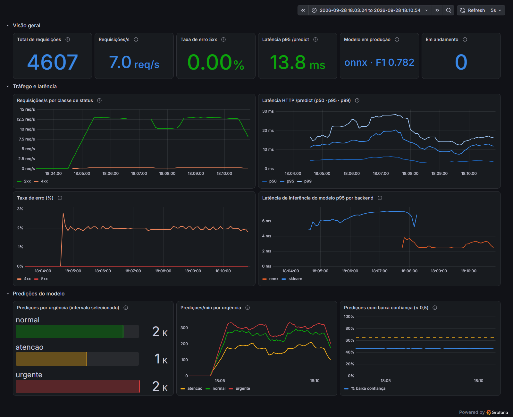

# Otimização de latência — sklearn vs ONNX Runtime

Técnica aplicada: **conversão do pipeline (TF-IDF + Regressão Logística) para ONNX** (`skl2onnx`) e inferência com **ONNX Runtime** (`GraphOptimizationLevel.ORT_ENABLE_ALL`, 1 thread por sessão). Código em [`export_onnx.py`](../src/medical_triage/models/export_onnx.py) e [`predictor.py`](../src/medical_triage/models/predictor.py).

## Resumo

| Medição | sklearn | ONNX | Ganho |
|---|---|---|---|
| Só o modelo, in-process, p50 | 1,19 ms | 0,57 ms | **2,1x** |
| Só o modelo, no container (Prometheus), média | 3,17 ms | 1,23 ms | **2,6x** |
| Só o modelo, no container (Prometheus), p95 | 7,02 ms | 2,49 ms | **2,8x** |
| HTTP `/predict` medido no servidor, p95 | 16,4 ms | 10,0 ms | **−39%** |
| HTTP `/predict` medido no servidor, p99 | 26,6 ms | 14,7 ms | **−45%** |
| Tamanho do artefato | 3,51 MB | 2,58 MB | −27% |
| Paridade (1.782 laudos de teste) | — | 100% dos rótulos iguais, diferença máxima de probabilidade 2,6e-7 | — |

O ONNX virou o backend padrão da imagem e do `docker-compose.yml`. O sklearn continua disponível com `MODEL_BACKEND=sklearn`.

## 1. Benchmark in-process

[`scripts/benchmark_latency.py`](../scripts/benchmark_latency.py): 2.000 laudos reais do conjunto de teste, um por chamada, com 100 de aquecimento. A medição inclui o `clean_text`. Máquina local (Windows, Python 3.14). Resultado bruto em [`benchmark_inprocess.json`](benchmark_inprocess.json).

| Backend | média | p50 | p95 | p99 | lote de 64 (laudos/s) |
|---|---|---|---|---|---|
| sklearn | 1,21 ms | 1,19 ms | 1,54 ms | 1,89 ms | **2.955** |
| ONNX | **0,61 ms** | **0,57 ms** | **0,99 ms** | **1,29 ms** | 2.297 |

Em **lote**, o sklearn tem mais vazão (0,78x para o ONNX): a multiplicação esparsa dele amortiza bem com muitos documentos, e o ONNX está limitado a 1 thread. Como a triagem é **real-time, com um laudo por requisição**, o caso que importa é o de um laudo por chamada, e nele o ONNX é 2x mais rápido.

## 2. A/B no container, medido no servidor

Stack do `docker-compose.yml`: o mesmo container, primeiro com `MODEL_BACKEND=sklearn` e depois com `onnx`. Cada backend recebeu 2,5 min de carga a 15 req/s com concorrência 2 (`scripts/load_test.py --rate 15 -c 2`). Os percentis vêm dos histogramas Prometheus da própria API, em janelas separadas ([`server_side_ab.json`](server_side_ab.json)). Como são interpolados dos buckets, são aproximados.

| Backend | modelo, média | modelo, p50 | modelo, p95 | modelo, p99 | HTTP p50 | HTTP p95 | HTTP p99 |
|---|---|---|---|---|---|---|---|
| sklearn | 3,17 ms | 2,63 ms | 7,02 ms | 9,24 ms | 5,41 ms | 16,4 ms | 26,6 ms |
| ONNX | **1,23 ms** | **1,00 ms** | **2,49 ms** | **4,60 ms** | **3,69 ms** | **10,0 ms** | **14,7 ms** |

*No painel "Latência de inferência do modelo p95 por backend", a linha azul é o sklearn (18:04–18:07) e a laranja é o ONNX (18:08–18:10).*

## 3. Ponta a ponta, medido no cliente

A latência vista pelo cliente inclui o encaminhamento de porta do Docker Desktop no Windows, que soma cerca de 10 ms e varia bastante entre execuções. Com isso, o ganho do modelo aparece diluído:

| Execução (1.500 req, concorrência 1) | sklearn p50 / p95 | ONNX p50 / p95 | Vazão sklearn → ONNX |
|---|---|---|---|
| 1 (sklearn primeiro) | 20,6 / 48,6 ms | 12,5 / 31,5 ms | 42 → 65 req/s |
| 2 (ONNX primeiro) | 15,9 / 32,2 ms | 12,7 / 31,7 ms | 55 → 63 req/s |

Arquivos: `http_{sklearn,onnx}_c1*.json`. A execução 1 do sklearn sofreu com ruído do host, e a 2 é a mais representativa. Em nuvem, com rede de verdade, o overhead fixo muda, mas o ganho no modelo (seções 1 e 2) se mantém.

## Paridade: o que precisou ser corrigido

A primeira conversão "ingênua" mudava **1% das predições**, com diferença de até 0,086 na probabilidade. Isso é inaceitável em triagem. A investigação encontrou quatro causas:

| Causa | Efeito | Correção |
|---|---|---|
| O tokenizer do skl2onnx usa `[a-zA-Z0-9_]+`, enquanto o do sklearn exige 2 ou mais caracteres | tokens de 1 caractere ("a", "5") entravam e mudavam os bigramas de todos os documentos | regex `[a-zA-Z0-9_][a-zA-Z0-9_]+` no conversor; `clean_text` passa o texto para ASCII para que as duas regex equivalham |
| `sublinear_tf`: o skl2onnx calcula `log(1+tf)`, e o sklearn `1+log(tf)` | termos repetidos com peso diferente | treino com `sublinear_tf=False`; o macro-F1 de validação **subiu** de 0,750 para 0,761. O export recusa modelos com sublinear |
| Bigramas cuja 2ª palavra caiu no corte de `max_features` | o ONNX Runtime atribui 0 a esses bigramas (7 de 37 mil) | o treino remove esses n-gramas órfãos (`convertible_vocabulary`) |
| O `StringNormalizer` usa o locale `en_US.UTF-8` | a sessão ONNX nem inicializa na imagem `python:3.11-slim`; no Windows funcionava | locale `C` gravado no grafo, o que é seguro porque o texto já é ASCII |

Hoje o `export_onnx` **falha** se algum rótulo divergir ou se a diferença de probabilidade passar de 1e-4. Na DAG, isso barra a promoção. O CI sobe o container com os dois backends.

## Quantização (avaliada, não aplicada)

A quantização dinâmica INT8 do ONNX Runtime atua sobre pesos de `MatMul`/`Gemm`. Aqui, a matriz da regressão logística é pequena (5 × 50k) e o custo está na tokenização e na contagem de n-gramas, operações sobre strings que não são quantizáveis. O ganho esperado é marginal, e haveria risco de alterar probabilidades num modelo cuja paridade exata é requisito. Por isso ficamos só com o ONNX Runtime.
